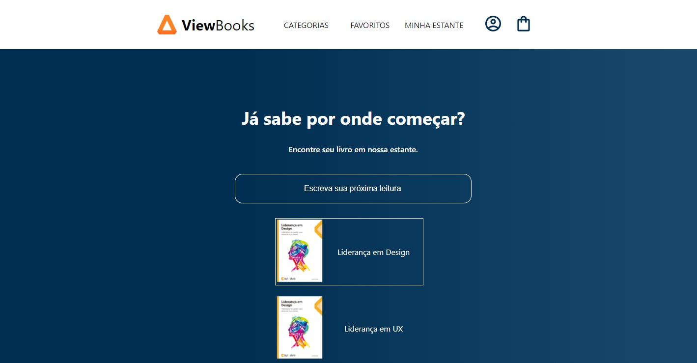

# View Book

Olá, Meu nome é Eduardo e esse é o Projeto é uma biblioteca de livros, projeto bem simples foi realizado seguindo um curso da plataforma Alura, no qual fiz algumas melhorias. Essa é meu primeiro projeto feito em React!
 
 

   <h1>Imagens do projetoe</h1>
   
   

 

## Como Executar?
Para executar primeiramente após a a instalação do projeto abra o cmd na pasta do projeto!. Após isso execute o comando `npm install`, espera a instalação ocorrer... Agora com o fim da instalação Execute o comando `npm start`. 
É necessário fazer isso para que seja criado um servidor local na sua maquina e assim abra o projeto. 

 

  Aqui são umas das linguagens de progamação que tenho conhecimento. e que utilizo para criar meus sites 💻
 

  
  
  
  
  
  
  
  
  
  
            
  ##
 

 
  
  
  
  
  
  

  
  
 

